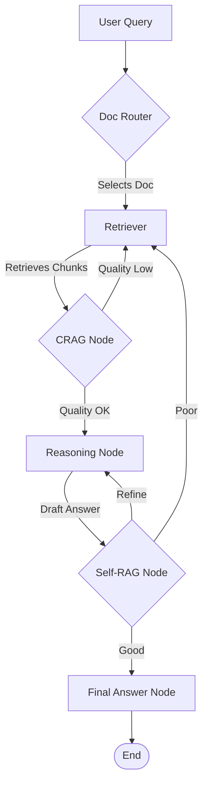

# Financial Report Analyst

The **Financial Report Analyst** is an advanced, AI-powered system designed to ingest, process, and perform complex reasoning over large collections of financial documents (such as annual reports). It utilizes **Retrieval-Augmented Generation (RAG)** combined with **GraphRAG** and **Self-RAG** paradigms to provide highly accurate, evidence-based answers to user queries regarding financial data.

## The Problem It Solves
Analyzing multiple, lengthy, and complex annual financial reports manually is time-consuming and prone to oversight. This project solves this by:
- **Centralizing Document Management:** Automatically parsing, chunking, and indexing disparate financial PDFs.
- **Smart Routing:** Intelligently identifying which document(s) are relevant to a specific user query, reducing noise and focusing retrieval on the most pertinent data.
- **Improved Retrieval & Reasoning:** Implementing a graph-based retrieval pipeline that iteratively refines search results, validates generated answers, and re-queries if necessary (CRAG and Self-RAG).
- **High-Fidelity Answers:** Minimizing hallucinations and ensuring factual accuracy by incorporating rigorous quality checks before providing a final response.

## Architecture

The system follows a modern microservices-based approach with a clear separation of concerns. The core logic resides in the **RAG Pipeline**, which manages query processing through a state-driven graph:

### Query Pipeline (LangGraph)

- **Doc Router:** Analyzes the query and selects relevant documents.
- **Retriever:** Retrieves relevant chunks from the Neo4j vector store.
- **CRAG (Corrective RAG):** Evaluates retrieved quality and decides whether to refine, re-retrieve, or move to reasoning.
- **Reasoning:** Synthesizes information into a draft answer.
- **Self-RAG:** Performs a final quality check on the answer.
- **Answer:** Formulates the final response for the user.

### Other Components
- **Backend API (FastAPI):** Orchestrates the RAG pipeline and manages document uploads.
- **Data Storage:**
  - **Vector Store (Neo4j):** Used for efficient semantic search of document chunks.
  - **Document Store:** Stores raw PDF documents.
- **Frontend (React):** Interface for uploading reports, querying, and viewing answers.

## Tech Stack
- **Backend:** Python, FastAPI, LangGraph, LangChain, Pydantic.
- **LLM/Embeddings:** Gemini (via `langchain-google-genai`), HuggingFace.
- **Database:** Neo4j (Graph/Vector Store).
- **Frontend:** React.
- **Infrastructure:** Local Python venv + Node, with a native Neo4j instance.

## Getting Started

1.  **Configure Environment:** Copy `backend/.env.example` to `backend/.env` and provide the necessary API keys (`GOOGLE_API_KEY`, etc.).
2.  **Start Neo4j:** Run a local Neo4j instance on `bolt://localhost:7687` with the credentials set in `backend/.env` (verify with `python check_neo4j.py`).
3.  **Install Dependencies:** Run `./bootstrap.sh` from the project root to create the Python venv, install backend requirements, and install frontend packages.
4.  **Run Backend:** `cd backend && source venv/bin/activate && uvicorn app.main:app --reload` (serve on `http://localhost:8000`).
5.  **Run Frontend:** `cd frontend && npm start` (serve on `http://localhost:3000`).
6.  **Use the System:** Navigate to the frontend, upload your reports, and start asking questions.

